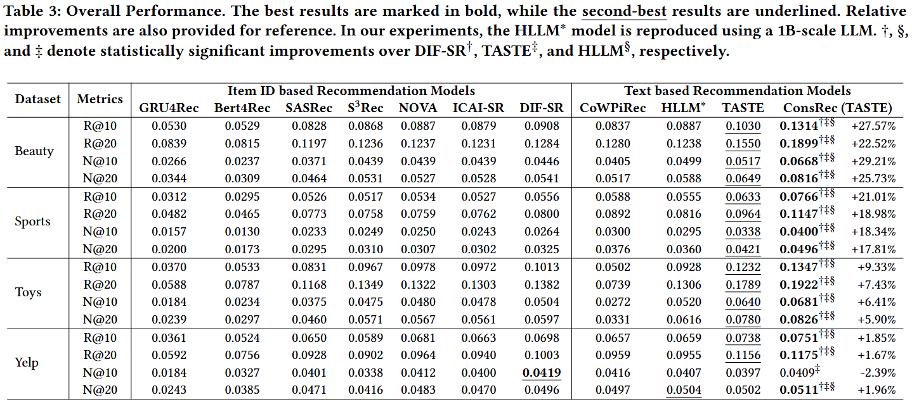

# ConsRec: Denoising Sequential Recommendation through User-Consistent Preference Modeling

This repository contains the source code for the paper: [ConsRec: Denoising Sequential Recommendation through User-Consistent Preference Modeling]().

[](https://arxiv.org/pdf/2505.22130)
[](https://huggingface.co/xhd0728/ConsRec)

## Overview

ConsRec addresses the challenge of noisy data in sequential recommendation by constructing a user-interacted item graph. It leverages item similarities derived from their text representations to extract the maximum connected subgraph, effectively denoising the items a user has interacted with. ConsRec demonstrates strong generalization capabilities by enhancing both item ID-based and text-based recommendation models.


## Requirements

### 1. Python Environment:

Install the following packages using Pip or Conda under this environment.

```
python >= 3.8
torch == 1.12.1
recbole == 1.2.0
datasets == 3.1.0
transformers == 4.22.2
sentencepiece == 0.2.0
faiss-cpu == 1.8.0.post1
scikit-learn >= 1.1.2
numpy >= 1.17.2
pandas >= 1.0.0
tqdm
jsonlines
networkx
```

### 2. Install Openmatch.

Refer to [https://github.com/OpenMatch/OpenMatch](https://github.com/OpenMatch/OpenMatch) for detailed instructions.

```bash
git clone https://github.com/OpenMatch/OpenMatch.git
cd OpenMatch
pip install -e .
```

### 3. Pretrained T5 weights.

Download pretrained T5 weights from Hugging Face.

```bash
git lfs install
git clone https://huggingface.co/google-t5/t5-base
```

*Note:* Ensure that `git lfs` is properly installed. You may need to run `git lfs install` before cloning the T5 weights.

## Reproduction Guide

This section provides a step-by-step guide to reproduce the ConsRec results.

> Warning: The model pre-training and fine-tuning process requires a lot of GPU resources, and the embedding vectors also take up a lot of space. Please make sure you have sufficient GPU resources and hard disk storage space.

### 1. Dataset Preprocessing

We utilize the Amazon Product 2014 and Yelp 2020 datasets. Download the original data from:

- [Amazon Product 2014](https://jmcauley.ucsd.edu/data/amazon/index_2014.html)
- [Yelp 2020](https://business.yelp.com/data/resources/open-dataset/)

The following example uses the Amazon Beauty dataset.

#### 1.1. Download and Prepare Amazon Beauty Dataset:

```bash
wget -c http://snap.stanford.edu/data/amazon/productGraph/categoryFiles/ratings_Beauty.csv
wget -c http://snap.stanford.edu/data/amazon/productGraph/categoryFiles/meta_Beauty.json.gz
```

#### 1.2. Unzip the Metadata File:

```bash
gzip -d meta_Beauty.json.gz
```

#### 1.3. Organize Files:

```bash
mkdir data
mv ratings_Beauty.csv data/
mv meta_Beauty.json data/
```

#### 1.4. Process Raw Data for Recbole:

```bash
mkdir dataset
bash scripts/process_origin.sh
```

#### 1.5. Extract and Process Required Data:

```bash
bash scripts/process_beauty.sh
```

### 2. Data Preprocessing for Training $\text{M}_{Filter}$

Before proceeding, process all four original datasets as described above to obtain the atomic files. Then, construct the mixed pretraining data for $\text{M}_{Filter}$ according to your desired proportions.

#### 2.1. Construct Training and Test Data using Recbole:

```bash
bash scripts/gen_dataset.sh
```

#### 2.2. Generate Item Representations using $\text{M}_{Rec}$:

```bash
bash scripts/gen_pretrain_items.sh
```

#### 2.3. Sample Training Data for $\text{M}_{Filter}$:

For $\text{M}_{Filter}$ training data construction, we sampled the four datasets with balance. For each dataset, we selected the number of items corresponding to the dataset with the largest number of training samples and then randomly supplemented the datasets with insufficient training data:

```bash
python src/sample_train.py
```

#### 2.4. Sample Validation Data:

Similarly, we selected the number of training samples from the dataset with the fewest training items in each case to serve as the validation set:

```bash
python src/sample_valid.py
```

#### 2.5. Construct Pretraining Data for Sampled Items:

```bash
bash scripts/build_pretrain.sh
```

#### 2.6. Merge Training and Validation Data:

```bash
python src/merge_json.py
```

### 3. Pretraining for $\text{M}_{Filter}$

Pretrain the T5 model using next item prediction (NIP) and mask item prediction (MIP) tasks.

```bash
bash scripts/train_mfilter.sh
```

Adjust training parameters based on your GPU device. Select the checkpoint with the lowest evaluation loss as the final $\text{M}_{Filter}$ .

### 4. Generate Embedding Representations using \text{M}_{Filter}

Save the item embedding representations to avoid redundant calculations.

```bash
mkdir embedding
bash scripts/gen_gembeddings.sh
```

### 5. Denoise Dataset by Calculating the Maximum Connected Subgraph

Embed the nodes into an undirected graph and use BFS to calculate the maximum connected subgraph.

```bash
bash scripts/build_graph.sh
```

Copy the original item information file to the denoised data folder.

```bash
cp dataset/beauty/beauty.item dataset/beauty_filtered/
mv dataset/beauty_filtered/beauty.item dataset/beauty_filtered/beauty_filtered.item
```

### 6. Build Standardized Training Data for $\text{M}_{Rec}$ using Recbole

```bash
bash scripts/gen_dataset.sh
bash scripts/gen_train_items.sh
bash scripts/build_train.sh
```

### 7. Training $\text{M}_{Rec}$

```bash
bash scripts/train_mrec.sh
```

### 8. Evaluate $\text{M}_{Rec}$

```bash
bash scripts/eval_mrec.sh
```

### 9. Test $\text{M}_{Rec}$

```bash
bash scripts/test_mrec.sh
```

## Experimental Result

<!--  -->
| Dataset | Metrics | GRU4Rec | Bert4Rec | SASRec | S $^3$ Rec | NOVA | ICAI-SR | DIF-SR | CoWPiRec | DWSRec | HLLM $^{[1]}$ | TASTE | ConsRec |
|---------|---------|---------|----------|--------|-------|------|---------|--------|-----------|--------|--------|--------|---------|
| Beauty | R@10 | 0.0530 | 0.0529 | 0.0828 | 0.0868 | 0.0887 | 0.0879 | 0.0908 | 0.0837 | 0.0989 | 0.0887 | 0.1030 | 0.1249 |
|          | R@20 | 0.0839 | 0.0815 | 0.1197 | 0.1236 | 0.1237 | 0.1231 | 0.1284 | 0.1280 | 0.1496 | 0.1238 | 0.1550 | 0.1774 |
|          | N@10 | 0.0266 | 0.0237 | 0.0371 | 0.0439 | 0.0439 | 0.0439 | 0.0446 | 0.0405 | 0.0470 | 0.0499 | 0.0517 | 0.0641 |
|          | N@20 | 0.0344 | 0.0309 | 0.0464 | 0.0531 | 0.0527 | 0.0528 | 0.0541 | 0.0517 | 0.0597 | 0.0588 | 0.0649 | 0.0772 |
| Sports | R@10 | 0.0312 | 0.0295 | 0.0526 | 0.0517 | 0.0534 | 0.0527 | 0.0556 | 0.0588 | 0.0629 | 0.0555 | 0.0633 | 0.0721 |
|           | R@20 | 0.0482 | 0.0465 | 0.0773 | 0.0758 | 0.0759 | 0.0762 | 0.0800 | 0.0892 | 0.0958 | 0.0816 | 0.0964 | 0.1082 |
|           | N@10 | 0.0157 | 0.0130 | 0.0233 | 0.0249 | 0.0250 | 0.0243 | 0.0264 | 0.0300 | 0.0313 | 0.0295 | 0.0338 | 0.0372 |
|           | N@20 | 0.0200 | 0.0173 | 0.0295 | 0.0310 | 0.0307 | 0.0302 | 0.0325 | 0.0376 | 0.0396 | 0.0360 | 0.0421 | 0.0463 |
| Toys | R@10 | 0.0370 | 0.0533 | 0.0831 | 0.0967 | 0.0978 | 0.0972 | 0.1013 | 0.0502 | 0.0967 | 0.0928 | 0.1232 | 0.1304 |
|         | R@20 | 0.0588 | 0.0787 | 0.1168 | 0.1349 | 0.1322 | 0.1303 | 0.1382 | 0.0739 | 0.1472 | 0.1306 | 0.1789 | 0.1896 |
|         | N@10 | 0.0184 | 0.0234 | 0.0375 | 0.0475 | 0.0480 | 0.0478 | 0.0504 | 0.0272 | 0.0457 | 0.0520 | 0.0640 | 0.0637 |
|         | N@20 | 0.0239 | 0.0297 | 0.0460 | 0.0571 | 0.0567 | 0.0561 | 0.0597 | 0.0331 | 0.0585 | 0.0616 | 0.0780 | 0.0786 |
| Yelp | R@10 | 0.0361 | 0.0524 | 0.0650 | 0.0589 | 0.0681 | 0.0663 | 0.0698 | 0.0657 | 0.0702 | 0.0659 | 0.0738 | 0.0749 |
|         | R@20 | 0.0592 | 0.0756 | 0.0928 | 0.0902 | 0.0964 | 0.0940 | 0.1003 | 0.0959 | 0.1103 | 0.0955 | 0.1156 | 0.1173 |
|         | N@10 | 0.0184 | 0.0327 | 0.0401 | 0.0338 | 0.0412 | 0.0400 | 0.0419 | 0.0416 | 0.0382 | 0.0407 | 0.0397 | 0.0408 |
|         | N@20 | 0.0243 | 0.0385 | 0.0471 | 0.0416 | 0.0483 | 0.0470 | 0.0496 | 0.0497 | 0.0482 | 0.0504 | 0.0502 | 0.0509 |

[1] HLLM is reproduced using a 1B-scale LLM.


## Acknowledgement

- [OpenMatch](https://github.com/OpenMatch/OpenMatch): We utilize OpenMatch to reproduce the $\text{M}_{Rec}$ module.
- [Recbole](https://github.com/RUCAIBox/RecBole): We leverage RecBole for dataset processing and baseline reproduction.

## Citation

If you find this work useful, please cite our paper and give us a shining star 🌟

```bibtex
@inproceedings{xin2025consrec,
  title={ConsRec: Denoising Sequential Recommendation through User-Consistent
Preference Modeling},
  author={Xin, Haidong and Xiong, Qiushi and Liu, Zhenghao and Mei, Sen and Yan, Yukun and Yu, Shi and Wang, Shuo and Gu, Yu and Yu, Ge and Xiong, Chenyan},
  year={2025},
  url={https://arxiv.org/pdf/2505.22130}
}
```

## Contact

For questions, suggestions, or bug reports, please contact:

```
xinhaidong@stumail.neu.edu.cn
```