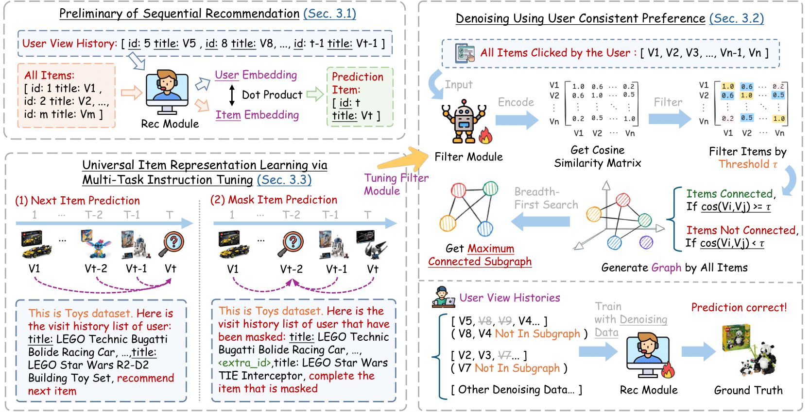

# ConsRec: Denoising Sequential Recommendation through User-Consistent Preference Modeling

Source code for our paper: [Denoising Sequential Recommendation through User-Consistent Preference Modeling]().

## Overview

ConsRec constructs a user-interacted item graph, learns item similarities from their text representations, and then extracts the maximum connected subgraph from the user-interacted item graph for denoising items. Notably, ConsRec shows the generalization ability by broadening its advantages to both item ID-based and text-based recommendation models.



## Requirement

1.Install the following packages using Pip or Conda under this environment.

```
python >= 3.8
torch == 1.12.1
recbole == 1.2.0
datasets == 3.1.0
transformers == 4.22.2
sentencepiece == 0.2.0
faiss-cpu == 1.8.0.post1
numpy >= 1.17.2
pandas >= 1.0.0
tqdm
jsonlines
```

2.Install openmatch. More details can be found at [https://github.com/OpenMatch/OpenMatch](https://github.com/OpenMatch/OpenMatch)

```bash
git clone https://github.com/OpenMatch/OpenMatch.git
cd OpenMatch
pip install -e.
```

3.Prepare the pretrained T5 weights.

```bash
git lfs install
git clone https://huggingface.co/google-t5/t5-base
```

## Reproduce ConsRec (Still Updating!)

### 1. Dataset preprocessing

We use the Amazon Pruduct 2014 dataset and the Yelp 2020 dataset for our experiments. The original data can be downloaded from the official website:

- [Amazon Product 2014](https://jmcauley.ucsd.edu/data/amazon/index_2014.html)
- [Yelp 2020](https://business.yelp.com/data/resources/open-dataset/)

Here we take the Amazon Beauty dataset as an example. First, we extract the user-item interaction information in the original dataset. We only need to extract the user_id, item_id and description attributes:

```bash
# Download Amazon Beauty Dataset
wget -c http://snap.stanford.edu/data/amazon/productGraph/categoryFiles/ratings_Beauty.csv
wget -c http://snap.stanford.edu/data/amazon/productGraph/categoryFiles/meta_Beauty.json.gz

# Unzip the ".gz" file to get "meta_Beauty.json"
gzip -d meta_Beauty.json.gz

# Move files to "data/" folder
mkdir data
mv ratings_Beauty.csv data/
mv meta_Beauty.json data/

# Process the raw data into atomic files that can be recognized by Recbole
mkdir dataset
bash scripts/process_origin.sh

# Keep the necessary data and process it into ".csv" files
bash scripts/process_beauty.sh
```

### 2. Data preprocessing for training $\text{M}_{Filter}$

Before that, you need to process the four original datasets separately according to the above process and get the atomic files, and then construct the mixed pretraining data of $\text{M}_{Filter}$ according to the proportion.

Here, we use recbole to construct training and test data from the dataset atom files:

```bash
bash scripts/gen_dataset.sh
```

Then, we use $\text{M}_{Rec}$ to generate item representations:

```bash
bash scripts/gen_all_items.sh
```

For $\text{M}_{Filter}$ training data construction, we sampled the four datasets with balance. For each dataset, we selected the number of items corresponding to the dataset with the largest number of training samples and then randomly supplemented the datasets with insufficient training data:

```bash
python src/sample_train.py
```

Similarly, we selected the number of training samples from the dataset with the fewest training items in each case to serve as the validation set:

```bash
python src/sample_valid.py
```

Then, we need to construct pretraining data for the training/valid data items sampled from each dataset.

```bash
bash scripts/build_pretrain.sh
```

Finally, we merge the training data and validation data separately:

```bash
python src/merge_json.py
```

### 3. Pretraining for $\text{M}_{Filter}$

We use two tasks, next item prediction (NIP) and mask item prediction (MIP), to pretrain the T5 model:

```bash
bash scripts/train_mfilter.sh
```

Adjust the training parameters according to the GPU device, and then select the checkpoint with the lowest eval loss as the final $\text{M}_{Filter}$.

### 4. Generate embedding representation using $\text{M}_{Filter}$

In order to avoid repeated calculation of the item embedding representation in subsequent steps, we save the embedding representation information in advance:

```bash
bash scripts/gen_gembeddings.sh
```

### 5. Calculate the maximum connected subgraph to denoise the dataset

### 6. Build standardized training data for $\text{M}_{Rec}$ module using Recbole

```bash
bash scripts/gen_dataset.sh
```

### 7. mrec训练

### 8. mrec评估

### 9. mrec测试

## Acknowledgement

- [OpenMatch](https://github.com/OpenMatch/OpenMatch): We use OpenMatch, a open source toolkit, to reproduce the $\text{M}_{Rec}$ module.
- [Recbole](https://github.com/RUCAIBox/RecBole): We use RecBole, a unified, comprehensive and efficient recommendation library, to process the dataset and reproduct baselines.

## Citation

If you find this work useful, please cite our paper and give us a shining star 🌟

```
@inproceedings{xin2025consrec,
  title={Denoising Sequential Recommendation through User-Consistent Preference Modeling},
  author={},
  journal={},
  year={2025}
}
```

## Contact

If you have questions, suggestions, and bug reports, please email:

```
xinhaidong@stumail.neu.edu.cn
```