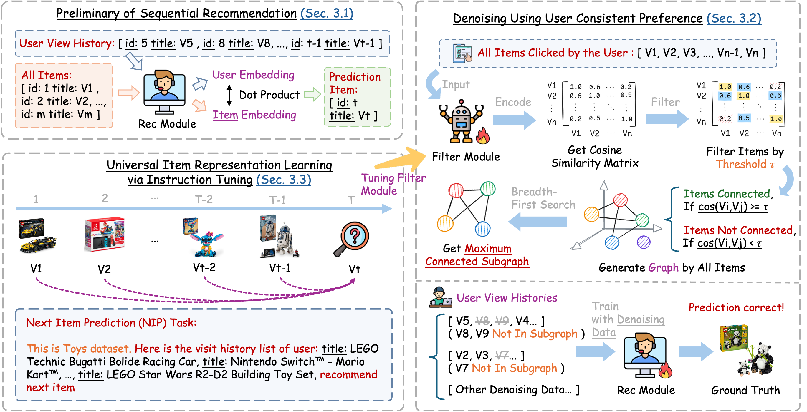

# ConsRec

Source code for our paper: [Denoising Sequential Recommendation through User-Consistent Preference Modeling]().

If you find this work useful, please cite our paper and give us a shining star 🌟

```
@inproceedings{xin2025consrec,
  title={Denoising Sequential Recommendation through User-Consistent Preference Modeling},
  author={},
  journal={},
  year={2025}
}
```

## Overview

ConsRec constructs a user-interacted item graph, learns item similarities from their text representations, and then extracts the maximum connected subgraph from the user-interacted item graph for denoising items. Notably, ConsRec shows the generalization ability by broadening its advantages to both item ID-based and text-based recommendation models.



## Requirement

1.Install the following packages using Pip or Conda under this environment.

```
python >= 3.8
torch == 1.12.1
recbole == 1.2.0
datasets == 3.1.0
transformers == 4.22.2
sentencepiece == 0.2.0
faiss-cpu == 1.8.0.post1
numpy >= 1.17.2
pandas >= 1.0.0
tqdm >=4.40.0
```

2.Install openmatch. More details can be found at [https://github.com/OpenMatch/OpenMatch](https://github.com/OpenMatch/OpenMatch)

```bash
git clone https://github.com/OpenMatch/OpenMatch.git
cd OpenMatch
pip install -e.
```

3.Prepare the pretrained T5 weights.

```bash
git lfs install
git clone https://huggingface.co/google-t5/t5-base
```

## Reproduce ConsRec (Still Updating!)

### 1. Dataset preprocessing

We use the Amazon Pruduct 2014 dataset and the Yelp 2020 dataset for our experiments. The original data can be downloaded from the official website:

- [Amazon Product 2014](https://jmcauley.ucsd.edu/data/amazon/index_2014.html)
- [Yelp 2020](https://business.yelp.com/data/resources/open-dataset/)

Here we take the Amazon Beauty dataset as an example. First, we extract the user-item interaction information in the original dataset. We only need to extract the user_id, item_id and description attributes:

```bash
# Download Amazon Beauty Dataset
wget -c http://snap.stanford.edu/data/amazon/productGraph/categoryFiles/ratings_Beauty.csv
wget -c http://snap.stanford.edu/data/amazon/productGraph/categoryFiles/meta_Beauty.json.gz

# Unzip the ".gz" file to get "meta_Beauty.json"
gzip -d meta_Beauty.json.gz

# Move files to "data/" folder
mv ratings_Beauty.csv data/
mv meta_Beauty.json data/

# Process the raw data into atom files that can be recognized by Recbole
bash scripts/process_origin.sh

# Keep the necessary data and process it into ".csv" files
bash scripts/process_beauty.sh
```

### 2. 构建mfilter训练数据

### 3. 预训练mfilter

### 4. 使用mfilter生成嵌入表示

```bash
bash scripts/gen_gembeddings.sh
```

### 5. 计算最大连通子图

### 6. 使用recbole处理数据

### 7. mrec训练

### 8. mrec评估

### 9. mrec测试

## Acknowledgement

- [OpenMatch](https://github.com/OpenMatch/OpenMatch): We use OpenMatch, a open source toolkit, to reproduce the $\text{M}_{Rec}$ module.
- [Recbole](https://github.com/RUCAIBox/RecBole): We use RecBole, a unified, comprehensive and efficient recommendation library, to process the dataset and reproduct baselines.

## Contact

If you have questions, suggestions, and bug reports, please email:

```
xinhaidong@stumail.neu.edu.cn
```